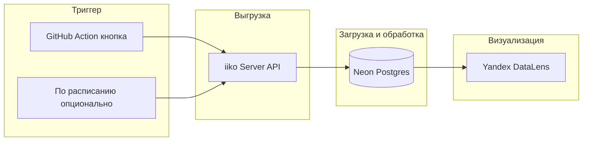

# Дата-аналитика: маркетинговая аналитика кафе в DataLens

**Цель:** визуализация маркетинговой аналитики по кафе Room Broom в Yandex DataLens.

**Поток данных:** GitHub (код + кнопка выгрузки) → iiko Server API → Neon (БД + постобработка) → DataLens.

## Схема потока данных

## Быстрый старт

- **Запустить выгрузку:** GitHub → Actions → workflow «Выгрузка из iiko» → Run workflow.
- **Смотреть дашборды:** Yandex DataLens, подключение к Neon (см. [datalens/README.md](datalens/README.md)).
- **Секреты и ключи:** только в GitHub Secrets и переменных окружения, не в репозитории. Настройка: [github/README.md](github/README.md).

## Подпапки

| Папка | Назначение |
|-------|------------|
| [github/](github/) | Репозиторий, секреты, GitHub Actions (workflows) |
| [iiko/](iiko/) | Код и описание работы с iiko Server API |
| [etl/](etl/) | ETL: маржа, нагрузка по часам, типы скидок (iiko OLAP → Neon) для дашборда «Маржа» |
| [neon/](neon/) | Схема БД, постобработка, витрины для DataLens |
| [datalens/](datalens/) | Подключение к Neon, датасеты, дашборды |
| [docs/](docs/) | Документация: iiko Server API (iiko-server-api.md) и прочее |
